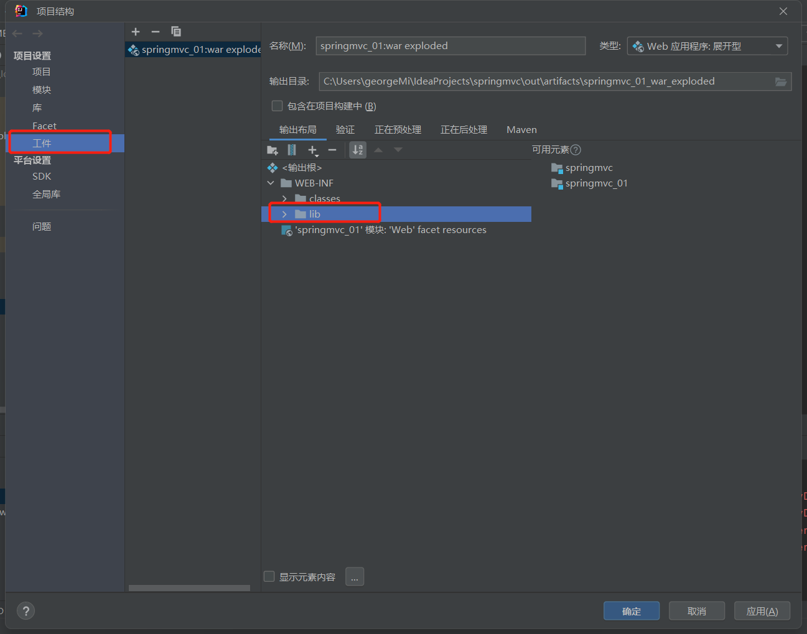
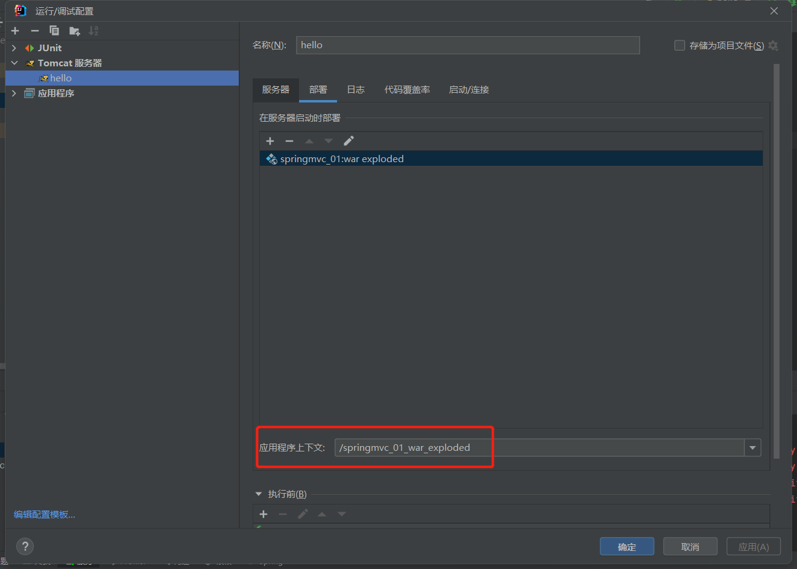

### 配置最原始的spring-mvc项目

在IDEA中需要设置输出的lib文件，把spring中的依赖库都输出到WEB-INF/lib目录下

### 注意点2
在配置好tomcat之后，启动的时候，默认目录是`localhost:8080/springmvc_01_war_exploed`
如果需要改变访问目录前缀，需要自己手动调整。

### 注意点3

windows平台下，tomcat启动之后日志会乱码，找到Tomcat安装目录下的conf文件夹里的logging.properties文件
，把UTF-8编码改为GBK